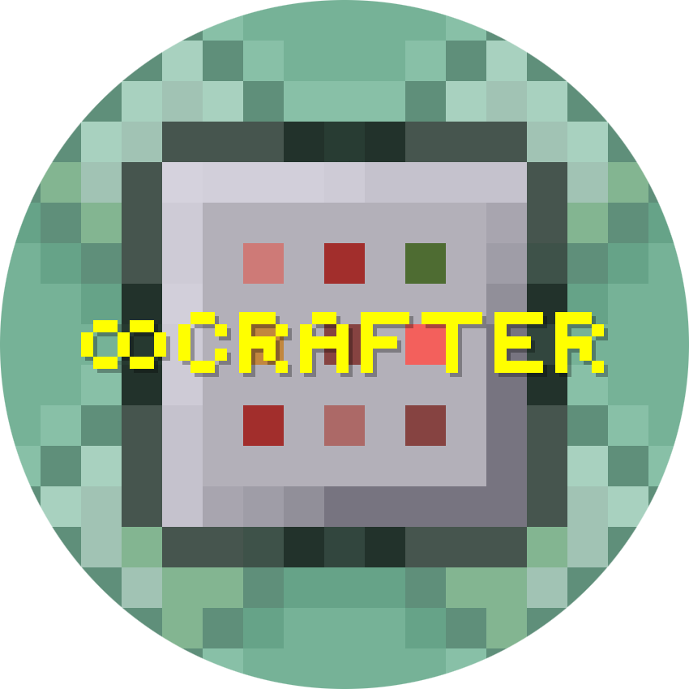

  

<h1 align="center">BlueShadow</h1>

  <a href="https://bluemods.neocities.org">https://bluemods.neocities.org</a>

  <marquee behavior="alternate" direction="left" scrollamount="5">
    CEO of BlueMods Studios, specializing in Minecraft scripting and web development.
  </marquee>

  

  
  
  
  

---

  

<h1 align="center">Trokkk</h1>

  <a href="https://bluemods.neocities.org">https://bluemods.neocities.org</a>

  <marquee behavior="alternate" direction="left" scrollamount="5">
    The Developer of BlueMods AntiCheat and Github Contributor.
  </marquee>

  

  
  
  
  

---

  

<h1 align="center">ModdedPro</h1>

  <a href="https://mod-utility.neocities.org/">https://mod-utility.neocities.org/</a>

  <marquee behavior="alternate" direction="left" scrollamount="5">
    Aka MP09, A Minecraft Addon Scripter and Developer of Utility Mod.
  </marquee>

  

  
  
  
  

---

  

<h1 align="center">8Crafter</h1>

  <a href="https://www.8crafter.com/">https://www.8crafter.com/</a>

  <marquee behavior="alternate" direction="left" scrollamount="5">
    A Helper of BlueMods, Minecraft Addon Scripter and Content Creator.
  </marquee>

  

  
  
  
  

